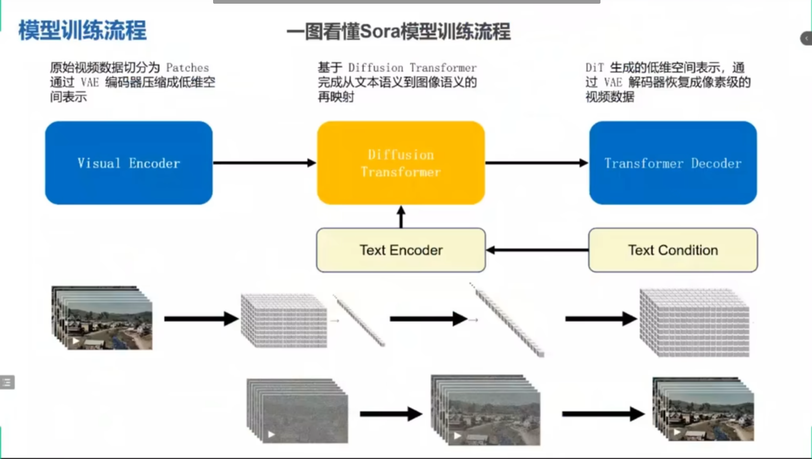
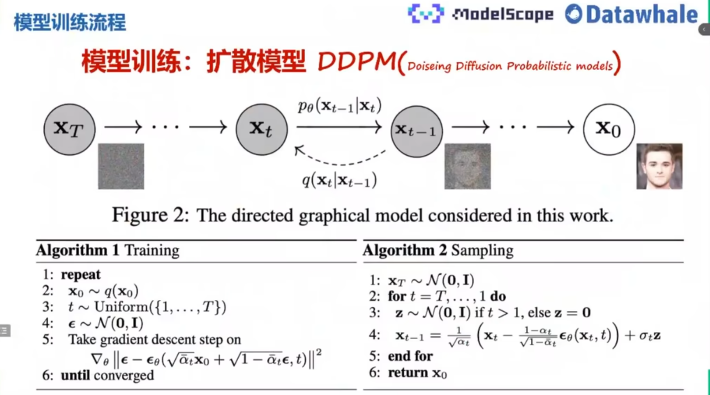
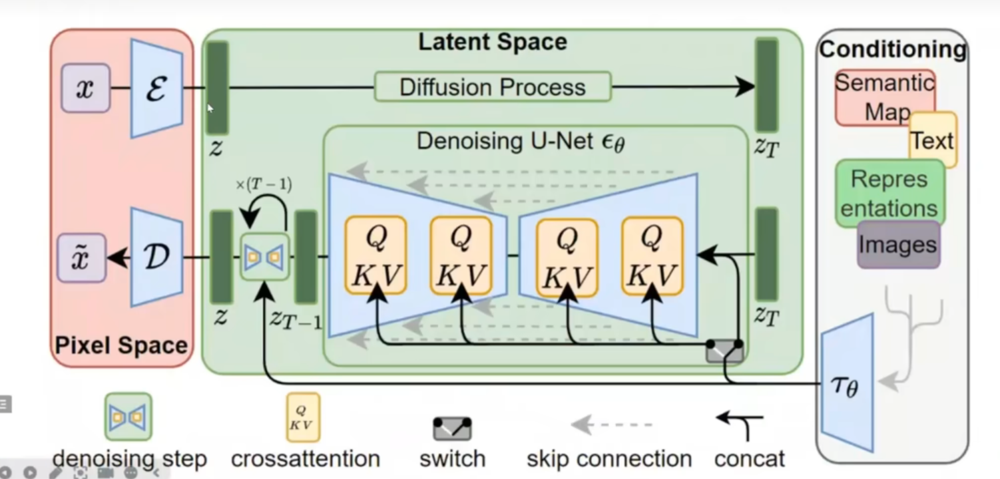
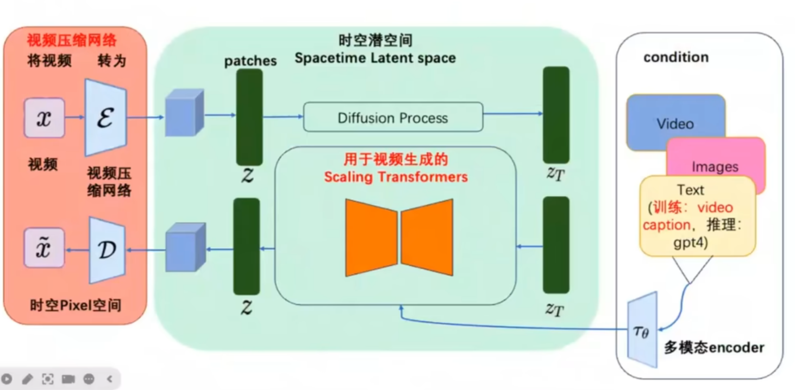
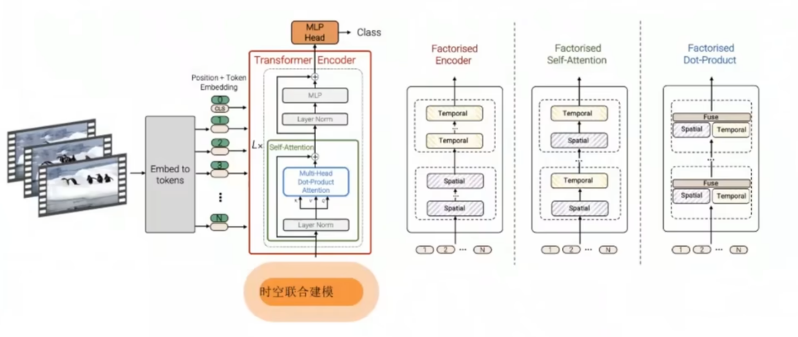
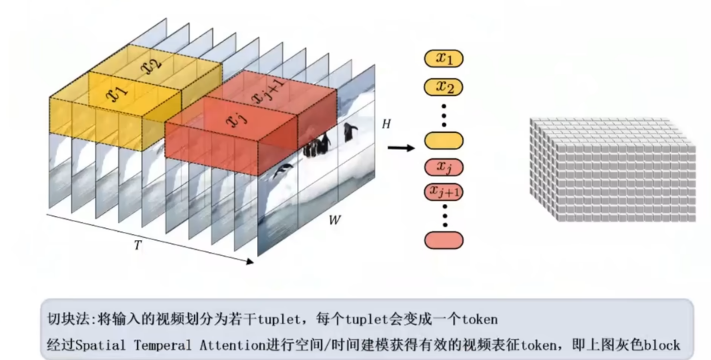
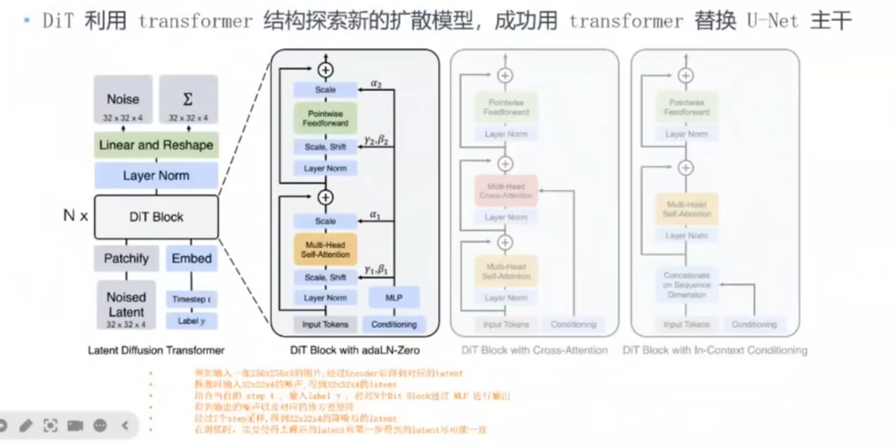

- Sora 目前具有的能力
	- 1、文本到视频生成能力：Sora能够根据用户提供的文本描述生成**长达60S**的视频，这些视频不仅保持了视觉品质，具有很好的连续性，而且完整准确还原了用户的提示语。
	- 2、复杂场景和角色生成能力：Sora能够生成包含多个角色、特定运动类型以及主题精确、背景细节复杂的场景。它能够创造出**生动的角色表情和复杂的运镜**，使得生成的视频具有高度的逼真性和叙事效果。
	- 3、语言理解能力：Sora拥有深入的语言理解能力，能够准确解释提示并生成能表达**丰富情感**的角色。这使得模型能够更好地理解用户的文本指令，并在生成的视频内容中忠实地反映这些指令。
	- 4、多镜头生成能力：Sora可以在**单个生成的视频中创建多个镜头**，同时保持角色和视觉风格的一致性。这种能力对于制作电影预告片、动画或其他需要多视角展示的内容非常有用。
	- 5、从静态图像生成视频能力：Sora不仅能够从文本生成视频，还能够从现有的**静态图像开始，准确地动画化图像内容**，或者扩展现有视频，填补视频中的缺失帧。
	- 6、物理世界模拟能力：Sora展示了人工智能在理解真实世界场景并与之互动的能力，这是朝着实现通用人工智能（AGI）的重要一步。它能够模拟真实物理世界的运动，如物体的移动和相互作用。
- Sora模型训练流程
	- 
	  id:: 65e0ad8f-4918-47c7-878e-f3417479989c
	- 1.原始数据切分成`Patches`，再通过VAE编码器压缩成低维空间表示（压缩映射）
		- 1.1统一表示成不同类型的视频数据
			- 通过
			- 
	- 2.基于`DiT`(Diffusion Transformer)架构完成 **文本语义**到**图像语义**的再度映射
		- 扩散模型`DDPM`
			- 先对图像加上噪声（一般是高斯噪声），再通过去噪来生成所需要的模型
			- 
			- 基于扩散模型主干的`U-Net`
				- 先通过`Image encoder`将真实的图像映射到潜空间`Latent space`中，然后在`Latent Space`中进行加噪和去噪的步骤，最后将`Latent space`映射回图像域中（通过 `image decoder`),以此来获得生成的图像。
				- U-Net的优势
					- 可以降低计算量来完成任务
				- 
		-
			- Stable Diffusion 的训练过程
				- 
				- 猜测的Sora训练模型
					- 
			- 3.`DiT`生成的低维空间表示，通过VAE解码器恢复成像素级的视频数据
				- `ViT`(Visual Transformer)
					- CV领域通过借鉴NLP的Transformer模型来进行任务。Patches 类似于NLP中的tokens的概念
					- 
				- `ViViT`
					- 视频信息中还有这时间与空间的信息，谷歌提出了三种处理的架构：时间空间先后进行和并列进行，但是实际结果相差不大。
					- 
				- 如何`Patch`化
					- 摊大饼法
						- 输入帧中均匀采样，然后采用`ViT`相同的法子嵌入帧中，并将token连接在一起
						- 
						- 切块法
							- 视频作为一个大的立方体切成一个个小的立方体（也就是`patches`)
							- 
				- `DiT` Diffusion Transformer
					- 模型架构
						- 
						- 
- Sora的技术难点猜测（原理上不难，工程实现有很大难度）
	- 训练数据
		- 训练中加入了物理引擎
		- 训练数据的质量高影响训练的结果
	- Scale up程度
		- 在OpenAI之前的基础上开展的进一步工作（DALL,CLIP等），考虑到实现的可能性和技术路径的传承。
		- 约莫是百亿级别的参数量
	- 训练收敛的trick
	- 如何实现长文本的支持
		- 视频是一下子生成60s的视频，没法进行两个视频的拼接（观点）
	- 如何实现视频中实体单独高质量和一致性？
	- VAE如何进行视频的压缩？
	-